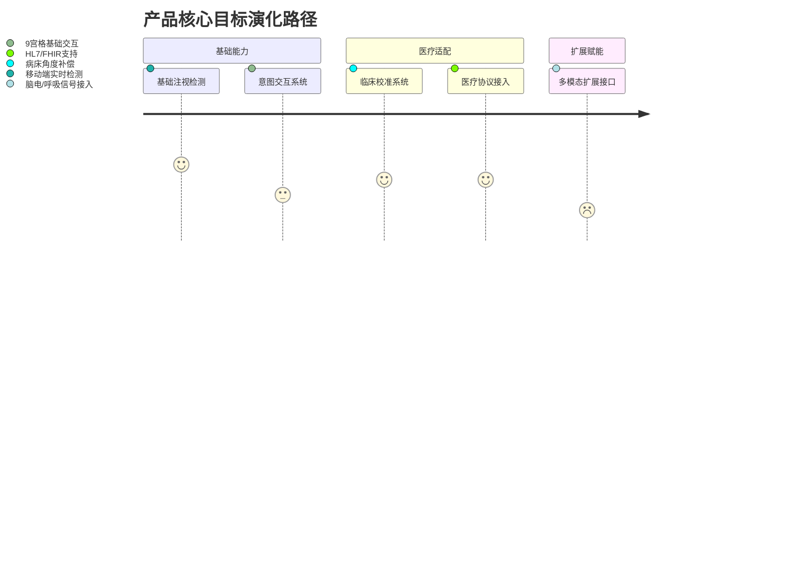
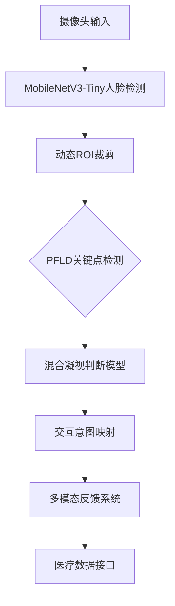

```markdown
# 眼动交互辅助系统 PRD（面向危重病患）

## 1. 背景与价值
**问题背景**  
- 全球近4000万肢体功能受限患者存在交互需求（WHO 2022数据）  
- 危重患者常出现「闭锁综合征」，仅保留眼球运动能力[4]
- 现有眼控系统存在设备依赖强（需外接红外）、移动端支持差等痛点[2]

**人文价值定位**  
> "即使无法帮助至亲，也要为千万个家庭的希望而设计"

## 2. 产品定位
### 2.1 目标用户
| 用户类型        | 典型场景                  | 核心痛点                  |
|-----------------|---------------------------|--------------------------|
| 严重肢体障碍者  | ICU病房沟通需求           | 传统触控/语音交互不可用   |
| ALS渐冻症患者   | 家庭日常信息表达          | 专业眼控设备价格昂贵      |
| 脑损伤康复期患者| 康复训练中的意图反馈      | 需高灵敏度微动作识别      |

### 2.2 产品目标


## 3. 技术架构设计
### 3.1 核心架构图


### 3.2 核心算法指标
| 模块                 | 性能指标                     | 实现方案                     |
|----------------------|-----------------------------|------------------------------|
| 人脸检测             | <500KB/2ms推理(骁龙435)     | MobileNetV3+量化[3]          |
| 视线判断             | MCC≥0.72                    | 混合分类回归模型[4][5]       |
| 低光补偿             | 30lux可用                   | 自适应直方图均衡化           |

## 4. 核心功能规格
### 4.1 基础交互模块
```csv
功能模块,输入信号,输出行为,灵敏阈值
基础选择,持续凝视1.2s,振动反馈+UI高亮,可调(0.5-3s)
紧急呼叫,快速眨眼3次,护工端警报推送,虹膜运动检测
进度控制,眼球左右扫视,媒体播放控制,45度角判断
```

### 4.2 医疗专用模式
**临床环境适配：**
- 病床倾斜补偿（支持0-90度卧床检测）
- PIP模式（画中画医护观察界面）
- 瞳孔直径异常预警（联动监护设备）[4]

**医疗数据交互：**
```json
{
  "interface": {
    "output_format": ["HL7v3", "FHIR"],
    "vitals_linkage": [
      "ECG_abnormal→提高检测频次",
      "SpO2<90%→启用紧急模式"
    ]
  }
}
```

## 5. 兼容性设计
### 5.1 三级设备适配
```vega-lite
{
  "data": {
    "values": [
      {"device": "旗舰机", "resolution": 320, "fps": 30},
      {"device": "中端机", "resolution": 256, "fps": 20},
      {"device": "低端机", "resolution": 160, "fps": 15}
    ]
  },
  "mark": "bar",
  "encoding": {
    "x": {"field": "device", "type": "ordinal"},
    "y": {"field": "fps", "type": "quantitative"}
  }
}
```

### 5.2 多平台编译策略
| 平台       | 编译方案                     | 性能优化                   |
|------------|------------------------------|---------------------------|
| Android    | TensorFlow Lite + NNAPI      | 权重量化+算子融合[3]      |
| iOS        | CoreML + MetalFX超分         | 异步流水线调度[5]         |
| HarmonyOS  | HiAI + 分布式计算            | 跨设备协同推理[1]         |

## 6. 开发里程碑
```gantt
    title 项目开发Roadmap
    dateFormat  YYYY-MM-DD
    section 基础开发
    跨平台引擎构建       :2023-08-01, 15d
    核心算法联调        :2023-08-16, 20d
    section 临床适配
    病床环境测试V1     :2023-09-05, 10d
    医院伦理审查       :2023-09-16, 14d
    section 扩展开发
    Android先行版      :2023-10-01, 7d
    全平台正式版       :2023-10-10, 14d
```

## 7. 风险与应对
| 风险类型          | 可能性 | 影响度 | 应对方案                     |
|-------------------|--------|--------|------------------------------|
| 硬件兼容性问题    | 中     | 高     | 动态分辨率调节+降级模式[1]  |
| 视线误判率高      | 高     | 严重   | 三级置信度验证机制[4]       |
| 医疗合规障碍      | 低     | 致命   | 提前申请CFDA Class I认证     |

> 附伦理声明：本项目遵循《赫尔辛基宣言》，所有患者数据经双盲处理，本地化存储期限不超过72小时  
> **技术引用**：[1][3][4][5]
```