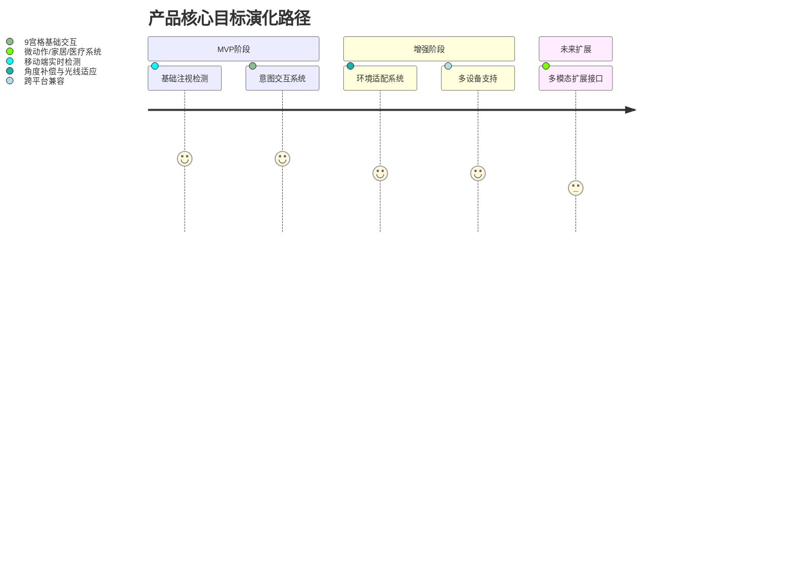
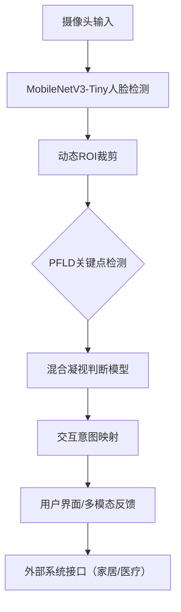

# 眼动交互辅助系统 PRD（面向行动不便人士）V2

## 1. 背景与价值
**问题背景**  
- 全球近4000万肢体功能受限患者存在交互需求（WHO 2022数据）  
- 危重患者常出现「闭锁综合征」，仅保留眼球运动能力[4]
- 现有眼控系统存在设备依赖强（需外接红外）、移动端支持差等痛点[2]

**人文价值定位**  
> "为无法自由活动的人们提供沟通的桥梁，让每个声音都能被听见"

## 2. 产品定位
### 2.1 目标用户
| 用户类型        | 典型场景                  | 核心痛点                  |
|-----------------|---------------------------|--------------------------|
| 严重肢体障碍者  | 日常沟通需求/医疗场景     | 传统触控/语音交互不可用   |
| ALS渐冻症患者   | 家庭日常信息表达          | 专业眼控设备价格昂贵      |
| 脑损伤康复期患者| 康复训练中的意图反馈      | 需高灵敏度微动作识别      |
| 老年及临时行动不便者 | 智能家居/娱乐控制      | 交互门槛高，缺乏适配      |

### 2.2 产品形态与分层
- **基础版（通用公益）**：极简交互、核心功能永久免费，适配家庭、康复、养老等场景。
- **医疗版（专业扩展）**：支持医疗协议（HL7/FHIR）、临床校准、医护联动、合规认证，适配医院/ICU/康复中心。
- **高级版（可选付费）**：多模态输入、智能家居联动、数据分析报告等增值功能。

### 2.3 产品目标


## 3. 技术架构设计
### 3.1 核心架构图


### 3.2 技术栈与实现
- **AI模型**：MobileNetV3/PFLD轻量模型，ONNX/NCNN/TFLite多框架支持，权重量化。
- **平台兼容**：Android（优先）、iOS、HarmonyOS，Flutter/React Native跨平台UI。
- **本地推理**：所有人脸/眼动数据本地处理，绝不上传云端。
- **医疗接口**：医疗版支持HL7/FHIR等标准协议。
- **多模态扩展**：预留面部微表情、呼吸、语音等输入接口。

### 3.3 核心算法指标
| 模块                 | 性能指标                     | 实现方案                     |
|----------------------|-----------------------------|------------------------------|
| 人脸检测             | <500KB/2ms推理(骁龙435)     | MobileNetV3+量化[3]          |
| 视线判断             | MCC≥0.72                    | 混合分类回归模型[4][5]       |
| 低光补偿             | 30lux可用                   | 自适应直方图均衡化           |

## 4. 核心功能规格
### 4.1 基础交互模块（MVP核心）
```csv
功能模块,输入信号,输出行为,灵敏阈值
基础选择,持续凝视1.2s,振动反馈+UI高亮,可调(0.5-3s)
紧急呼叫,快速眨眼3次,声音提示+通知,虹膜运动检测
进度控制,眼球左右扫视,媒体播放控制,45度角判断
```

### 4.2 多场景与多模态适配
**多场景适配：**
- 卧床/病床补偿（支持0-90度角度检测）
- 低光环境增强（室内弱光条件下可用）
- 移动端稳定性（减少抖动干扰）
- 智能家居/娱乐控制（高级版）

**多模态输入（高级/医疗版）：**
- 面部微表情、呼吸、语音等辅助输入
- 医疗设备联动（如心电/血氧异常自动触发）

**用户体验优化：**
```json
{
  "interface": {
    "customization": [
      "交互速度可调节(0.5-3s)",
      "界面布局可定制",
      "声音/振动/动画反馈可选择",
      "外部设备联动反馈（如智能灯）"
    ],
    "accessibility": [
      "高对比度模式",
      "大字体支持",
      "简化界面选项",
      "辅助教程与引导"
    ]
  }
}
```

## 5. 兼容性设计
### 5.1 三级设备适配
```vega-lite
{
  "data": {
    "values": [
      {"device": "旗舰机", "resolution": 320, "fps": 30},
      {"device": "中端机", "resolution": 256, "fps": 20},
      {"device": "低端机", "resolution": 160, "fps": 15}
    ]
  },
  "mark": "bar",
  "encoding": {
    "x": {"field": "device", "type": "ordinal"},
    "y": {"field": "fps", "type": "quantitative"}
  }
}
```

### 5.2 多平台编译策略
| 平台       | 编译方案                     | 性能优化                   |
|------------|------------------------------|---------------------------|
| Android    | TensorFlow Lite + NNAPI      | 权重量化+算子融合[3]      |
| iOS        | CoreML + MetalFX超分         | 异步流水线调度[5]         |
| HarmonyOS  | HiAI + 分布式计算            | 跨设备协同推理[1]         |

## 6. 开发里程碑
```gantt
    title 项目开发Roadmap
    dateFormat  YYYY-MM-DD
    section MVP开发
    核心算法实现       :2023-08-01, 15d
    基础交互系统       :2023-08-16, 20d
    section 用户测试
    内部测试          :2023-09-05, 10d
    小规模用户测试     :2023-09-16, 14d
    section 正式版
    Android先行版      :2023-10-01, 7d
    全平台正式版       :2023-10-10, 14d
    section 医疗版/高级版
    医疗协议/家居联动  :2023-10-25, 14d
```

## 7. 风险与应对
| 风险类型          | 可能性 | 影响度 | 应对方案                     |
|-------------------|--------|--------|------------------------------|
| 硬件兼容性问题    | 中     | 高     | 动态分辨率调节+降级模式[1]  |
| 视线误判率高      | 高     | 严重   | 三级置信度验证机制[4]       |
| 用户适应性差异    | 中     | 中     | 提供可调节灵敏度和教程      |
| 医疗合规障碍      | 低     | 致命   | 医疗版提前申请认证           |
| 隐私合规风险      | 低     | 高     | 全程本地处理+用户可控数据删除|

## 8. 用户测试与反馈计划
### 8.1 测试指标
- **准确率**：不同环境下的指令识别准确率
- **响应时间**：从眼动到系统响应的延迟时间
- **用户满意度**：使用体验评分和主观反馈
- **学习曲线**：新用户掌握基本操作所需时间
- **医疗场景适配性**（医疗版）：医护反馈、合规性

### 8.2 反馈收集机制
- 内置简化版反馈表单（可通过眼动操作）
- 辅助人员观察记录（针对无法独立完成反馈的用户）
- 使用数据匿名分析（使用频率、错误率等，默认本地存储）
- 医疗版支持医护端反馈与合规日志

## 9. 未来扩展（非当前开发重点）
### 9.1 潜在扩展方向
- **多模态输入**：结合其他微动作识别（如面部肌肉、呼吸、语音等）
- **智能家居控制**：连接智能家居设备的接口
- **医疗系统集成**：为未来可能的医疗应用预留接口
- **国际化**：适配多语言和不同国家法规

### 9.2 商业模式考量
- 初期采用限免策略，快速获取用户反馈和口碑
- 基础功能永久免费，高级功能（如家居联动、数据报告、医疗接口）采用订阅/一次性付费
- B端合作：与医院、康复中心、养老机构等合作，提供定制化解决方案
- 公益与社会责任：与公益组织、残障协会合作，争取政策/资金支持
- 评估服务器、数据存储等运营成本，长期以本地化为主

> **技术引用**：[1][3][4][5]
> **隐私与伦理声明**：本应用尊重用户隐私，所有处理默认在本地进行，用户可随时删除数据。医疗版遵循相关法规与认证要求。 