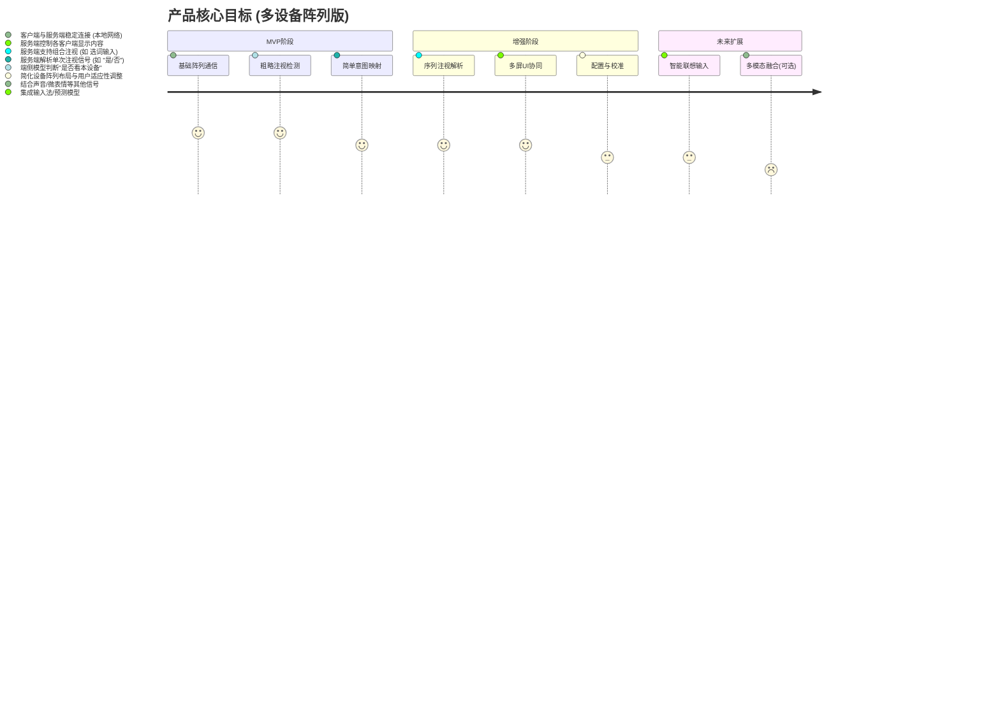

# 眼动交互辅助系统 PRD V3 (多设备阵列版)

## 1. 背景与价值
### 1.1 问题背景
- **核心需求**：为因病重（如闭锁综合征晚期）导致肢体、语言能力完全丧失，仅能进行有限眼球转向的用户（特指用户父亲的现状），提供一种低成本、易部署的沟通方式。
- **现有方案痛点**：
    - 专业眼控设备：价格昂贵，部署复杂，需专业人员校准。
    - 单设备眼动追踪APP（如WebGazer或前期PRD方案）：在低端设备或小屏幕上精度不足，难以区分细微视线落点；对于仅能粗略转动眼球的用户可能无效。
- **用户资源限制**：无法承担昂贵设备，但拥有多台闲置旧手机/平板。

### 1.2 创新方案：多设备阵列粗略注视检测
- **核心思路**：化整为零，变精确追踪为方向判断。利用多台普通移动设备（手机/平板）组成阵列，分布在用户视野不同区域。每台设备仅需判断"用户是否在注视本设备屏幕的大致方向"，而非精确视线落点。
- **优势**：
    - **低成本**：可利用闲置旧设备。
    - **低精度要求**：无需高精度眼动追踪，降低算法难度和硬件要求。
    - **大范围交互**：设备物理分散，天然放大交互目标区域，适合眼球活动范围有限的用户。

### 1.3 人文价值定位
> "用科技的温度，连接微弱的意念，让爱意在目光流转间传递。"

## 2. 产品定位
### 2.1 目标用户
- **核心用户**：因严重疾病（如ALS晚期、严重脑损伤、闭锁综合征）导致全身瘫痪、失语，仅能通过有限的、非精确的眼球转向表达意图的用户。
- **次要用户**：看护人员（负责系统设置、维护、辅助沟通）。

### 2.2 产品形态
- **分布式系统**：由多个客户端App（运行在阵列设备上）和一个服务端/协调器App（可运行在其中一台设备或单独PC/平板上）组成。
- **软件核心**：提供客户端注视检测App和服务端协调App。

### 2.3 产品目标


## 3. 系统架构设计
### 3.1 核心架构图
```mermaid
graph LR
    subgraph 用户视野
        Device1[客户端设备1 App]
        Device2[客户端设备2 App]
        DeviceN[客户端设备N App]
    end

    subgraph 服务端/协调器 (可运行于某台设备或独立设备)
        Coordinator[协调器App]
        Logic[交互逻辑处理]
        State[状态管理]
        UI_Manager[多屏UI管理器]
        Network[本地网络通信模块]
    end

    Device1 -- 注视信号/状态 --> Network
    Device2 -- 注视信号/状态 --> Network
    DeviceN -- 注视信号/状态 --> Network

    Network <--> Logic
    Network <--> UI_Manager
    Logic --> State
    UI_Manager -- 更新指令 --> Network

    Coordinator -- 控制/显示 --> 物理屏幕/声音等
```

### 3.2 组件说明
- **客户端设备App**：
    - 运行在阵列中的每台手机/平板上。
    - **主要功能**：
        - 调用摄像头获取视频流。
        - 运行轻量级视觉模型，判断用户是否正脸朝向**本设备屏幕**。
        - 将"正在被注视"/"未被注视"的状态信号通过本地网络发送给服务端。
        - 接收服务端的指令，更新自身屏幕显示内容（如显示"是"、"否"或特定文字/图片）。
- **服务端/协调器App**：
    - 运行在一台性能稍好的设备或PC上（也可复用某台客户端设备，但需注意性能）。
    - **主要功能**：
        - 监听和接收所有客户端发送的状态信号。
        - **交互逻辑处理**：根据收到的信号（哪个设备被注视，持续时间，序列等）解析用户意图。
        - **状态管理**：维护当前交互状态（如正在输入、等待选择等）。
        - **多屏UI管理器**：决定每个客户端屏幕应显示的内容，并通过网络发送更新指令。
        - **本地网络通信**：建立和维护与所有客户端的连接（如使用UDP广播发现、TCP/UDP P2P通信或本地MQTT）。
        - （可选）提供主显示界面和配置界面。

### 3.3 核心技术点
- **端侧注视检测模型**：
    - **目标**：二分类问题（注视本设备 / 未注视本设备）。
    - **方案**：基于人脸检测 + 头部姿态估计 或 简化版视线方向估计。关键在于区分"大致朝向屏幕"与"明显看向别处"。重点是**鲁棒性**而非精度。
    - **性能要求**：在低端旧手机上能实时运行（>5-10 FPS即可），低功耗。
- **本地网络通信**：
    - **要求**：低延迟、稳定、易于配置。
    - **方案**：Wi-Fi P2P、UDP广播/组播、本地MQTT Broker等。
- **服务端意图解析逻辑**：
    - **简单映射**：注视设备A -> "是"，注视设备B -> "否"。
    - **序列映射**：按顺序注视 设备A -> 设备C -> 设备B 实现复杂输入（如九宫格选字）。
    - **时间阈值**：需要设定注视持续多久才算有效信号，以过滤无意识的扫视。

## 4. 核心功能规格
### 4.1 客户端App功能
- **摄像头访问与预览**（可选，主要用于调试）。
- **注视检测模型加载与运行**。
- **状态信号发送**（设备ID + 注视状态 + 时间戳）。
- **屏幕内容显示**（根据服务端指令全屏显示文字/颜色/图片）。
- **网络连接管理**（自动发现/连接服务端）。

### 4.2 服务端/协调器App功能
- **设备管理**：发现、连接、管理已接入的客户端设备。
- **信号接收与处理**：实时接收各客户端状态。
- **交互模式配置**：
    - **模式选择**：支持配置不同的交互模式（如"是/否"判断、四向选择、序列输入等）。
    - **设备角色分配**：为每个连接的客户端设备分配在当前模式下的意义（如 设备1代表"是"，设备2代表"否"）。
    - **参数调整**：配置注视有效时间阈值、序列超时时间等。
- **UI内容分发**：根据当前交互模式和状态，向各客户端发送显示内容指令。
- **主显界面**（可选）：如果服务端有屏幕，可显示汇总信息、用户输入历史、系统状态等。
- **配置与校准界面**：引导看护人员进行设备布局、用户适应性调整。

### 4.3 交互流程示例（四设备布局）
- **场景**：用户前方、左方、右方、下方各放置一台设备。服务端在另一台设备上。
- **配置**：
    - 左设备 -> 显示"需要帮助"
    - 右设备 -> 显示"我没事"
    - 下设备 -> 显示"继续输入"
    - 前设备 -> 显示"主菜单/状态"
- **交互**：
    1. 用户看向左设备超过1.5秒。
    2. 左设备App检测到注视，发送信号给服务端。
    3. 服务端收到信号，解析为"需要帮助"，触发报警或通知看护人。
    4. 服务端通过UI管理器，可让所有设备屏幕闪烁或变色以示确认。

## 5. UI与用户体验
- **客户端UI**：极其简洁，通常是全屏显示单一信息（大字体文字、色块、简单图标），避免干扰注视检测。高对比度。
- **服务端UI**（如有屏）：
    - **配置界面**：图形化展示设备布局，拖拽分配角色，清晰的参数设置。
    - **主显界面**：简洁明了地展示当前状态、已输入内容、设备连接状态。
- **用户适应性**：
    - **灵敏度可调**：注视时间阈值应可调。
    - **布局灵活性**：允许看护人员根据用户习惯和环境调整设备物理位置。
    - **反馈机制**：明确的视觉（闪烁、变色）或听觉（提示音）反馈，告知用户操作已被接收。

## 6. 技术栈选型（建议）
- **客户端App**：
    - **平台**：Android (优先支持旧版本), iOS (可选)
    - **开发语言**：Java/Kotlin (Android), Swift/Objective-C (iOS) 或 跨平台框架 (如 Flutter, React Native，但需评估原生能力调用性能)
    - **视觉模型**：TensorFlow Lite, PyTorch Mobile, MNN, TNN 等端侧推理框架。模型可选用轻量级人脸检测+头部姿态估计组合。
- **服务端/协调器App**：
    - **平台**：Android, PC (Windows/Linux/Mac), 或 Web App
    - **开发语言**：Python (Flask/Django), Java/Kotlin, Node.js, C# 等均可。
    - **网络通信库**：根据选择的协议 (如 Socket, MQTT client/broker)。
- **本地网络通信协议**：
    - **设备发现**：UDP广播/组播, mDNS/Bonjour。
    - **数据传输**：TCP (可靠连接), UDP (低延迟), MQTT (发布/订阅模式)。

## 7. 风险与应对
| 风险类型              | 可能性 | 影响度 | 应对方案                                                     |
|-----------------------|--------|--------|--------------------------------------------------------------|
| 注视检测模型鲁棒性差   | 高     | 高     | 简化模型目标（仅判断朝向），收集特定场景数据微调，允许看护者调整阈值 |
| 多设备物理布局困难    | 中     | 中     | 提供布局建议和灵活的配置界面，简化校准流程                      |
| 本地网络不稳定/延迟高 | 中     | 高     | 优化网络协议选择，增加重传/心跳机制，提供网络状态诊断工具      |
| 服务端性能瓶颈        | 低     | 中     | 异步处理客户端信号，优化状态管理逻辑，必要时使用独立PC作服务端 |
| 用户适应与学习成本    | 中     | 中     | 提供清晰教程和看护人员指导，交互模式由简入繁                  |
| 环境光照/遮挡干扰     | 高     | 中     | 模型需考虑一定的光照不变性，提示用户避免强逆光/面部遮挡        |
| 隐私担忧              | 低     | 高     | 强调所有图像处理均在本地完成，服务端仅接收状态信号，不传图像      |

## 8. 未来扩展
- **更智能的输入法**：结合上下文预测、用户常用语。
- **更多设备联动**：控制智能家居（灯光、空调）。
- **多用户模式**：支持多个用户或场景配置切换。
- **看护端远程监控**（需严格考虑隐私和授权）。

## 9. 隐私与伦理声明
- 所有摄像头数据仅在客户端设备本地实时处理，用于注视方向判断，不存储、不上传原始图像。
- 服务端仅接收和处理来自客户端的匿名设备ID、注视状态信号和时间戳。
- 系统设计遵循最小权限原则，仅获取运行必要的功能权限。
- 明确告知用户和看护人员数据处理方式，提供数据清除选项。 