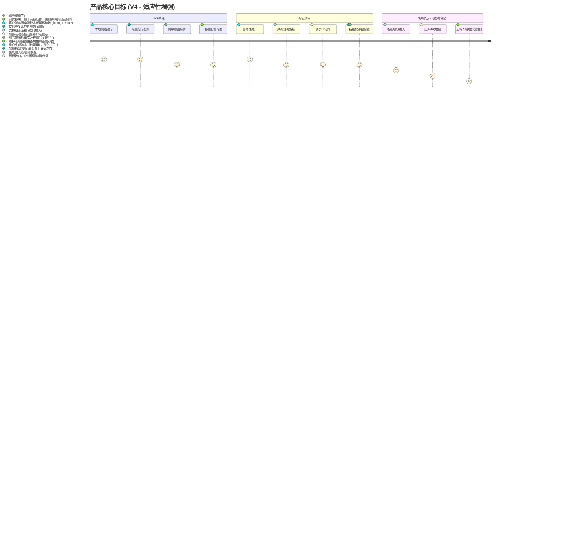

# 眼动交互辅助系统 PRD V4 (多设备阵列 - 适应性增强版)

## 1. 背景与价值
### 1.1 问题背景
- **核心需求**：为因严重疾病（如闭锁综合征、ALS晚期、严重脑损伤等）导致肢体、语言能力受限，但可能仍保留有限眼球/头部活动能力的用户，提供一种低成本、易部署、可靠的沟通方式。
- **目标场景适应性**：优先满足面部遮挡较少（如佩戴鼻氧管）、头部可轻微转动等较普遍情况，同时设计具备足够的**适应性和可配置性**，以尽可能兼容不同程度能力受限的用户（包括类似用户父亲的极端情况，但需认识到技术挑战）。
- **现有方案痛点**：
    - 专业眼控设备：昂贵、复杂、不便携。
    - 单设备眼动追踪APP：在低端设备/小屏幕上精度不足；对仅能粗略转向/头部活动有限的用户可能无效。
- **用户资源限制**：无法承担昂贵设备，但可能拥有多台闲置旧手机/平板。

### 1.2 创新方案：多设备阵列粗略方向检测
- **核心思路**：化整为零，变精确追踪为**鲁棒的方向判断**。利用多台普通移动设备组成阵列，分布在用户视野不同区域。每台设备仅需判断"用户是否在注视本设备屏幕的大致方向"（可结合头部姿态与眼部特征），而非精确视线落点。
- **优势**：低成本、低精度要求（重点是方向而非精确落点）、大范围交互、适应性强（通过物理布局和软件配置）。

### 1.3 人文价值定位
> "用科技的温度，连接微弱的意念，让爱意在目光流转间传递。"

## 2. 产品定位
### 2.1 目标用户
- **主要用户**：因疾病导致全身瘫痪、失语，但具备有限、可重复的眼球转向能力，且可能伴有轻微头部活动、面部有简单遮挡（如鼻氧管）的用户。
- **次要用户**：看护人员（负责系统设置、维护、参数调整、辅助沟通）。
- **设计原则**：优先保证主要用户的核心需求，同时通过**参数化设计**最大限度兼容能力更弱或更强的用户。

### 2.2 产品形态
- **分布式系统**：由多个客户端App（运行在阵列设备上）和一个服务端/协调器App（可运行在其中一台设备或单独PC/平板上）组成。
- **软件核心**：提供客户端方向检测App和服务端协调App。
- **核心原则**：**所有核心功能（特别是视觉感知和设备间通信）必须在本地网络内完成，不依赖互联网连接。**

### 2.3 产品目标


### 2.4 MVP 成功标准
为了明确界定第一阶段（MVP）的成功交付，设定以下可量化的验收标准：

*   **方向检测准确率**：在推荐的设备布局和正常室内光照条件下（如床头灯开启），对于明确的"看向设备A屏幕方向" vs "看向设备B屏幕方向"的动作，系统判断准确率达到 **≥ 80%**。
*   **系统响应时间**：从客户端检测到有效方向注视信号，到服务端完成意图解析并发出UI更新指令（或触发动作）的总时间，应 **≤ 500ms**。
*   **系统稳定性**：在模拟实际使用场景下（至少连接2个客户端设备），整个系统（客户端+服务端）能够连续稳定运行 **≥ 30分钟** 而不发生崩溃或无响应。
*   **核心任务完成度**：邀请看护人员或模拟用户进行测试，能够**可靠地使用系统完成预设的基础任务**，例如连续进行5次"是/否"选择，并得到正确的反馈。

## 3. 系统架构设计
### 3.1 核心架构图 (同V3)
```mermaid
graph LR
    subgraph 用户视野
        Device1[客户端设备1 App]
        Device2[客户端设备2 App]
        DeviceN[客户端设备N App]
    end

    subgraph 服务端/协调器 (可运行于某台设备或独立设备)
        Coordinator[协调器App]
        Logic[交互逻辑处理]
        State[状态管理]
        UI_Manager[多屏UI管理器]
        Network[本地网络通信模块]
    end

    Device1 -- 方向信号/状态 --> Network
    Device2 -- 方向信号/状态 --> Network
    DeviceN -- 方向信号/状态 --> Network

    Network <--> Logic
    Network <--> UI_Manager
    Logic --> State
    UI_Manager -- 更新指令 --> Network

    Coordinator -- 控制/显示 --> 物理屏幕/声音等
```

### 3.2 组件说明 (基本同V3，强调方向判断)
- **客户端设备App**：
    - ...
    - 运行轻量级视觉模型，判断用户是否大致朝向**本设备屏幕方向**（结合眼部特征和/或头部姿态）。
    - 将"正在被注视方向"/"未被注视方向"的状态信号发送给服务端。
    - ...
- **服务端/协调器App**：
    - ...
    - **交互逻辑处理**：根据收到的信号（哪个设备被注视方向，持续时间，序列，信号置信度等）解析用户意图。
    - ...
    - **本地网络通信**：**必须使用本地协议**（如本地MQTT Broker，UDP/TCP P2P），确保低延迟和无互联网依赖。
    - ...

### 3.3 核心技术点
- **端侧方向检测模型 (重点)**：
    - **目标**：鲁棒的二分类（用户视线大致朝向**本设备屏幕方向** / 未朝向本设备屏幕方向）。**重点是鲁棒性、实时性、低功耗**，而非毫米级精度。**需要考虑并补偿摄像头与屏幕之间的物理偏移量。**
    - **候选方案 (需测试验证)**：
        1.  **级联式轻量检测**：TinyFace (或其他轻量人脸检测器如YuNet) + PFLD (或其他轻量关键点模型) + 基于关键点的头部姿态/眼部区域分析。 *优势：可能更快更轻量。风险：遮挡下的关键点鲁棒性。*
        2.  **轻量人脸检测 + 姿态/简化视线**：如 MobileNet-SSD/YuNet + 头部姿态估计（基于关键点或模型）+ 简化视线方向模型（基于眼部区域纹理/形态）。 *优势：可能对姿态利用更充分。风险：模型复杂度可能稍高。*
        3.  **基于眼部区域的定制模型**：(针对极端情况的备选) 训练一个仅关注眼眶区域的模型。
    - **实现要点**：
        - **必须支持锁定相机曝光参数** (通过Camera2 API / CameraX)。在可控光照（如床头灯）下，对快门速度的限制（如iOS <1/30s）影响可能减小。
        - 模型需具备一定的光照、角度、轻微遮挡（如鼻氧管）**鲁棒性**。
        - **输出包含置信度**，供服务端逻辑参考。
    - **性能要求**：在目标低端旧手机上实时运行（**目标 > 5-10 FPS 即可接受**，因用户反应较慢且无需轨迹追踪），低功耗（设备专用于此应用可缓解）。

#### 实施策略与遮挡应对

考虑到实际应用中可能遇到的挑战，如固定焦距导致拍摄范围包含肩部、以及用户可能佩戴氧气管/鼻饲管甚至氧气面罩等面部遮挡物，我们确定以下实施策略：

1.  **核心目标转向眼部区域分析**：由于面部遮挡（特别是面罩）会严重影响基于全脸（尤其是下半脸）特征或关键点的分析，我们将把重点放在分析**眼部区域**来实现方向判断。
2.  **分步处理流程**：
    *   **步骤一：鲁棒的人脸/头部检测**：首要任务是尽可能可靠地检测到包含人脸（或至少是头部）的边界框 (Bounding Box)，即使在有一定遮挡的情况下也要争取成功。
    *   **步骤二：眼部区域定位**：基于上一步获取的边界框的位置和尺寸，通过**几何估计**（例如，根据一般人脸比例定位框内上半部左右两侧）或**特征点检测**（如果可用且可靠）来确定左右眼的大致区域。
    *   **步骤三：眼部区域分析与方向判断**：在定位到的眼部区域内，提取相关特征（后续详细设计），并结合设备位置、配置参数等，最终判断用户的注视方向是否朝向本设备。
3.  **初步实施方案 (使用 ML Kit)**：
    *   **选用库**：为了快速验证和迭代，我们首先采用 Google 的 `google_ml_kit_face_detection` 库。
    *   **主要任务**：
        *   集成库并运行人脸检测。
        *   验证在模拟遮挡（特别是面罩）情况下，获取人脸边界框的鲁棒性。
        *   实现基于边界框**估计**眼部区域位置的逻辑。
        *   在相机预览上绘制人脸边界框和估计的眼部区域框，用于调试和效果评估。
    *   **目的**：快速搭建处理流程，验证关键步骤（人脸检测、眼区定位）的可行性，并为后续的眼部区域分析奠定基础。
4.  **备选方案 (使用 TFLite Flutter)**：如果在测试中发现 `google_ml_kit_face_detection` 在实际遮挡条件下无法稳定检测到人脸边界框，则启动备选方案，使用 `tflite_flutter` 插件，以获得更大的模型选择和控制自由度（例如，尝试专门检测上半脸的模型，或对遮挡更鲁棒的人脸检测模型）。

- **本地网络通信**：
    - **方案**：优先考虑在服务端设备上运行**本地MQTT Broker**，客户端连接。备选：UDP广播发现 + TCP/UDP直连。
    - **要求**：低延迟 (<100ms)，稳定，易于配置。
- **服务端意图解析逻辑**：
    - **输入**：设备ID，方向状态，时间戳，（可选）置信度，（可选）头部姿态信息。
    - **处理**：结合时间阈值、状态序列、信号置信度、可配置的头部/眼部信号权重，以及**针对摄像头-屏幕偏移的补偿逻辑或标定结果**，进行意图判断。
    - **可配置性**：允许看护者调整**注视时间阈值、信号权重、视线接受角度/灵敏度**等关键参数以适应用户。

## 4. 核心功能规格
### 4.1 客户端App功能 (同V3)
...
### 4.2 服务端/协调器App功能
- ...
- **交互模式配置**：
    - ...
    - **参数调整**：**提供更丰富的可调参数**，如：注视有效时间阈值、序列超时时间、头部姿态信号权重（如启用）、眼部信号置信度阈值、**视线方向接受角度/偏移补偿参数**等。
- ...
- **配置与校准界面**：
    - 图形化设备布局。
    - **提供清晰的参数调整说明**，解释各参数对不同用户能力的适应性。
    - （可选）简单的实时信号反馈，**辅助看护者调整参数（特别是视线接受角度）**。

### 4.3 交互流程示例 (同V3)
...

## 5. UI与用户体验 (同V3，强调可配置)
- **客户端UI**：极简，高对比度，大字体/图标。
- **服务端UI**：
    - **配置界面**：易于理解的布局和参数设置，**提供预设配置模板**（如"仅眼动"、"眼动+头动"）。
    - **主显界面**：清晰状态反馈。
- **用户适应性**：
    - **参数化设计**：核心在于通过调整参数适应不同用户（**包括视线判断的灵敏度/角度**）。
    - **布局灵活性**：允许自由摆放设备，服务端配置其角色。
    - **明确反馈**：视觉/听觉确认。

## 6. 技术栈选型（建议）
- **客户端App**：
    - **平台**：**Android (优先, API Level 24+)**
    - **开发语言/框架**：**原生 Android (Java/Kotlin) + CameraX** (确保底层控制和性能)
    - **视觉模型推理框架**：TensorFlow Lite (优先), MNN, TNN等。
    - **视觉模型**：测试候选方案1或2，选择最优。
- **服务端/协调器App**：
    - **平台**：Android, PC (Windows/Linux/Mac)。
    - **开发语言**：Python, Java/Kotlin, Node.js等。
    - **本地网络**：**MQTT (Mosquitto 或其他本地 Broker)** 或 Raw Socket (TCP/UDP)。
- **离线词库**：**SQLite**

## 7. 风险与应对 (更新)
| 风险类型                  | 可能性 | 影响度 | 应对方案                                                                 |
|---------------------------|--------|--------|--------------------------------------------------------------------------|
| 方向检测模型鲁棒性不足     | 高     | 高     | 优先选型测试，参数化调整，融合头动（如可用），提供清晰的环境/使用指引       |
| 用户能力与模型不匹配      | 中     | 高     | **核心：提供丰富的可调参数和配置模板**，允许看护者根据实际情况适配            |
| **方向判断因视线偏移不准** | **中** | **高** | **算法考虑偏移补偿（几何/标定），提供接受角度/灵敏度参数供看护者调整** |
| 多设备物理布局/校准困难   | 中     | 中     | 提供布局建议，简化配置界面，（未来）考虑半自动校准                             |
| 本地网络不稳定/配置复杂   | 中     | 中     | 优先MQTT简化连接，提供网络诊断工具，清晰的设置向导                           |
| 面部严重遮挡/眼部条件差   | 中     | 致命   | **认识局限**，MVP优先服务普遍情况。对极端案例，明确告知需依赖未来扩展(IR) |
| 隐私担忧 (即使本地处理)   | 低     | 中     | **反复强调数据本地处理**，提供透明的权限说明和数据管理选项                     |
| 环境光照/角度剧烈变化     | 中     | 中     | **强制锁定相机参数**，模型训练考虑数据增强，提示用户保持相对稳定环境         |
| **模型性能在旧设备偏低**  | **中** | **中** | **确认最低可接受FPS(如5-10)，设备专用缓解资源压力，优先轻量模型**        |

## 8. 未来扩展 (明确优先级)
- **近期**：
    - **更智能的输入法/词库**：上下文预测，用户词频统计。
    - **更完善的配置与校准**：可视化反馈，半自动校准。
- **中期（可选，需额外硬件/工作量）**：
    - **红外(IR)增强模块**：为解决极端遮挡/光照问题提供硬件解决方案，需预留软件接口。
    - **更多设备联动**：控制智能家居（需标准接口或定制开发）。
- **远期（实验性，需用户明确同意风险）**：
    - **云端AI辅助模块**：**非核心功能**，用于特定高级任务（如复杂对话生成），用户需理解网络、隐私、延迟、成本影响。

## 9. 隐私与伦理声明 (强化)
- **数据绝对本地化**：所有摄像头数据**仅在客户端设备本地**实时处理，用于方向判断，**绝不存储、绝不上传**原始图像或特征数据到任何外部服务器（包括开发者服务器或第三方云）。
- **最小信号传输**：服务端仅接收和处理来自客户端的匿名设备ID、方向状态信号（如true/false）、时间戳和置信度评分，**不包含任何可识别个人身份或生物特征的信息**。
- **最小权限原则**：仅申请运行必要的权限（摄像头、本地网络）。
- **完全透明**：向用户和看护人员清晰、明确地解释系统工作原理、数据流向和隐私保护措施。
- **用户控制**：提供易于理解和操作的数据清除、系统停用选项。 

## 10. 开发方法论：测试驱动开发 (TDD) 规划

本项目将采用测试驱动开发（TDD）模式，遵循"红-绿-重构"的循环，以确保代码质量、驱动设计并提供回归保障。主要结合 Flutter 的单元测试、Widget 测试和集成测试进行。

### 10.1 TDD 分层测试策略
*   **单元测试 (Unit Tests)**：用于测试核心业务逻辑、数据模型、纯函数等，不依赖 Flutter 框架和外部服务。速度最快。使用 `flutter_test` 和 `mockito`/`mocktail`。
*   **Widget 测试 (Widget Tests)**：用于测试单个 Flutter Widget 的渲染和交互逻辑。速度居中。使用 `flutter_test`。
*   **集成测试 (Integration Tests)**：用于测试应用端到端流程，运行在真实设备/模拟器上。速度最慢。使用 `integration_test` 包。

### 10.2 TDD 开发阶段规划
*   **阶段 0：原型验证与环境适应 (Camera PoC) - TDD 轻度参与**
    *   目标：验证相机插件可行性（参数锁定、性能）。
    *   方法：手动测试驱动为主，辅以少量针对辅助逻辑的单元测试。
*   **阶段 1：核心数据结构与本地网络通信基础 (单元测试驱动)**
    *   目标：定义信号格式，建立模拟网络骨架。
    *   流程：测试驱动 `StatusSignal` 序列化/反序列化；测试驱动 `NetworkClient`/`NetworkServer` 的基本接口（使用 Mock）。
*   **阶段 2：服务端核心逻辑 (单元测试驱动)**
    *   目标：实现设备管理、状态机、意图解析。
    *   流程：测试驱动信号处理（含时间阈值）、状态更新、配置加载/保存等。
*   **阶段 3：客户端核心逻辑 (单元/Widget 测试驱动)**
    *   目标：集成模拟输入，管理状态，触发网络。
    *   流程：单元测试驱动状态管理器响应事件、触发网络；Widget 测试驱动 UI 响应状态变化。
*   **阶段 4：UI 交互与集成 (Widget/集成测试驱动)**
    *   目标：实现 UI，集成端到端流程。
    *   流程：Widget 测试驱动 UI 交互和响应网络指令；集成测试验证整体流程。

### 10.3 关键测试工具
*   `flutter_test` (SDK 内置)
*   `mockito` / `mocktail` (需要添加到 dev_dependencies)
*   `integration_test` (需要添加到 dev_dependencies) 